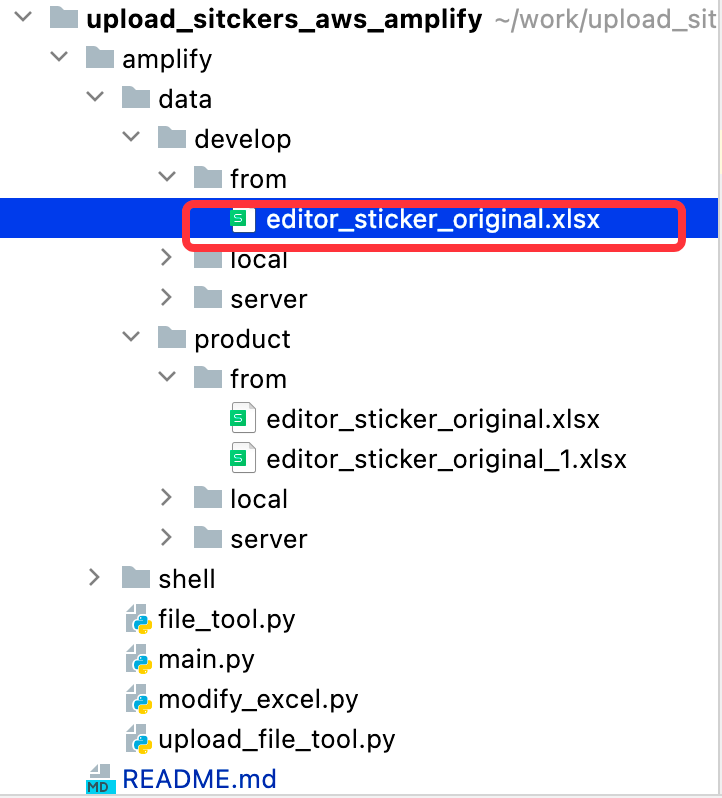
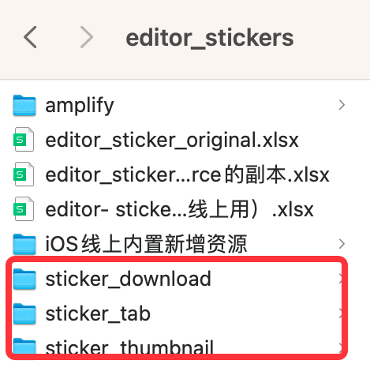

# upload_sitckers_aws_amplify
    处理本地数据到excel列表，然后上传到亚马逊

## 环境要求(请务必注意)
    1.node.js v14.19.1 (稳定版本)
    2.amplify v8.0.1
    3.python v3.8.9(3.0以上即可)

## 运行步骤（开发）
    1.按上述配置好环境
    2.修改内部的路径：
        # local path 资源文件目录：sticker_data_path
        # amplify 依赖的功能目录：project_path
    3.资源文件准备：从内部服务器： 192.168.31.68 访问贴纸资源，进行下载到本地，如需要账号请直接找邓卿成
    4.将上述的sticker_data_path从服务器拉到的资源文件本地根目录
    5.shell文件夹下的auto_check_file.sh 查看打印日志，无误则可以开始大干一场了！！！

## 运营配置须知
    1.运营只需要更新的文件为：
        1.如果只是修改线上数据的 上下线、vip限制、排序等，只需要通过修改对应的xlsx中的online， vipstate， sort等字段
        2.新增资源直接下面追加对应资源的全部字段

       

    2.修改该文件的前提是一定要确定新增的贴纸资源传到内部局域网 (192.168.31.68)的文件夹内部：
        1.结构如下图：

        2. 只需要把对用资源更新后告知对应的开发来跟进处理
